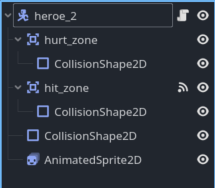
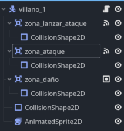
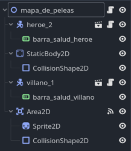

# Codigo para peleas, con animaciones, ataque y daño.

## Protagonista 
### Esquema de nodos



### derehca a izquierda y ciclo de animaciones


```
extends CharacterBody2D

const SPEED = 300.0
const JUMP_VELOCITY = -400.0

var atacando := false

func _ready() -> void:
	$zona_ataque/CollisionShape2D.disabled = true

func _physics_process(delta: float) -> void:
	if not is_on_floor():
		velocity += get_gravity() * delta

	if Input.is_action_just_pressed("ui_accept") and is_on_floor() and not atacando:
		$AnimatedSprite2D.play("saltar")
		velocity.y = JUMP_VELOCITY
		
	if Input.is_action_just_pressed("atacar") and is_on_floor() and not atacando:
		atacando = true
		$zona_ataque/CollisionShape2D.disabled = false
		$AnimatedSprite2D.play("ataque")
		await $AnimatedSprite2D.animation_finished
		$zona_ataque/CollisionShape2D.disabled = true
		atacando = false
		$AnimatedSprite2D.play("default")

	var direction := Input.get_axis("ui_left", "ui_right")

	if direction:
		velocity.x = direction * SPEED

		if direction < 0:
			$AnimatedSprite2D.flip_h = true
			$zona_ataque.scale.x = -1
		elif direction > 0:
			$AnimatedSprite2D.flip_h = false
			$zona_ataque.scale.x = 1
	else:
		velocity.x = move_toward(velocity.x, 0, SPEED)

	move_and_slide()

	if is_on_floor() and not atacando:
		if $AnimatedSprite2D.animation == "saltar":
			$AnimatedSprite2D.play("default")

```


### final

```
extends CharacterBody2D

const SPEED = 100.0
const ATTACK_COOLDOWN = 0.6
const DAMAGE = 20

@export var player: Node2D

var atacando_1 := false


func _ready() -> void:
	$AnimatedSprite2D.play("default")


func _physics_process(delta: float) -> void:
	if not is_on_floor():
		velocity += get_gravity() * delta

	if player == null:
		velocity.x = 0
		move_and_slide()
		return

	if atacando_1:
		velocity.x = 0
		move_and_slide()
		return

	move_towards_player()
	move_and_slide()

func move_towards_player() -> void:
	var direction: float = sign(player.global_position.x - global_position.x)

	velocity.x = direction * SPEED

	if is_on_floor() and not atacando_1:
		$AnimatedSprite2D.play("default")
	
	
	if direction < 0:
		look_left()
	elif direction > 0:
		look_right()

func look_left() -> void:
	$AnimatedSprite2D.flip_h = true
	$"zona_daño".scale.x = -1
	$"zona_ataque".scale.x = -1


func look_right() -> void:
	$AnimatedSprite2D.flip_h = false
	$zona_daño.scale.x = 1
	$zona_ataque.scale.x = 1


func _on_zona_ataque_2_body_entered(body: Node2D) -> void:
	if body.name == "heroe_2":
		atacando_1 = true
		$AnimatedSprite2D.play("ataque")
		await $AnimatedSprite2D.animation_finished
		atacando_1 = false


func _on_zona_ataque_body_entered(body: Node2D) -> void:
	print(body.name)
	if body.name == "heroe_2":
		vidas.vida_heroe = vidas.vida_heroe -10


func _on_zona_ataque_area_entered(area: Area2D) -> void:
	if area.is_in_group("guerrero") and atacando_1:
		print("ataque exitoso")
		await $AnimatedSprite2D.animation_finished
		vidas.vida_heroe = vidas.vida_heroe - 10 
```

## Enemigo




Notese que zona de daño pertenece a un grupo global creado para ello. 

Creacion por partes del enemigo, con movimiento hacia el jugador, animaciones y ataque.

```
extends CharacterBody2D

const SPEED = 100.0
const ATTACK_COOLDOWN = 0.6
const DAMAGE = 20

@export var player: Node2D

var attacking := false


func _ready() -> void:
	$"zona_daño"/CollisionShape2D.disabled = true
	$AnimatedSprite2D.play("default")
```


Físicas
```
func _physics_process(delta: float) -> void:
	if not is_on_floor():
		velocity += get_gravity() * delta

	if player == null:
		velocity.x = 0
		move_and_slide()
		return

	if attacking:
		velocity.x = 0
		move_and_slide()
		return

	move_towards_player()
	move_and_slide()
```

Animaciones
```
func move_towards_player() -> void:
	var direction: float = sign(player.global_position.x - global_position.x)

	velocity.x = direction * SPEED

	if is_on_floor():
		$AnimatedSprite2D.play("default")

	if direction < 0:
		look_left()
	elif direction > 0:
		look_right()

func look_left() -> void:
	$AnimatedSprite2D.flip_h = true
	$"zona_daño".scale.x = -1
	$"zona_ataque".scale.x = -1


func look_right() -> void:
	$AnimatedSprite2D.flip_h = false
	$zona_daño.scale.x = 1
	$zona_ataque.scale.x = 1
```

Ataque: 

```
func _on_attack_zone_body_entered(body: Node2D) -> void:
	if body.is_in_group("player"):
		start_attack()


func start_attack() -> void:
	if attacking:
		return

	attacking = true
	velocity.x = 0

	$"zona_daño"/CollisionShape2D.set_deferred("disabled", false)
	$AnimatedSprite2D.play("ataque")

	await $AnimatedSprite2D.animation_finished

	$"zona_daño"/CollisionShape2D.set_deferred("disabled", true)
	$AnimatedSprite2D.play("default")

	await get_tree().create_timer(ATTACK_COOLDOWN).timeout

	attacking = false


func _on_hitzone_area_entered(area: Area2D) -> void:
	if area.is_in_group("player_hurtbox"):
		print("El enemigo golpea al héroe")
		vidas.vida_heroe -= DAMAGE
```

### codigo final completo


```
extends CharacterBody2D

const SPEED = 100.0
const ATTACK_COOLDOWN = 0.6
const DAMAGE = 20

@export var player: Node2D

var atacando_1 := false


func _ready() -> void:
	$AnimatedSprite2D.play("default")


func _physics_process(delta: float) -> void:
	if not is_on_floor():
		velocity += get_gravity() * delta

	if player == null:
		velocity.x = 0
		move_and_slide()
		return

	if atacando_1:
		velocity.x = 0
		move_and_slide()
		return

	move_towards_player()
	move_and_slide()

func move_towards_player() -> void:
	var direction: float = sign(player.global_position.x - global_position.x)

	velocity.x = direction * SPEED

	if is_on_floor() and not atacando_1:
		$AnimatedSprite2D.play("default")
	
	
	if direction < 0:
		look_left()
	elif direction > 0:
		look_right()

func look_left() -> void:
	$AnimatedSprite2D.flip_h = true
	$"zona_daño".scale.x = -1
	$"zona_ataque".scale.x = -1


func look_right() -> void:
	$AnimatedSprite2D.flip_h = false
	$zona_daño.scale.x = 1
	$zona_ataque.scale.x = 1


func _on_zona_lanzar_ataque_body_entered(body: Node2D) -> void:
	if body.name == "heroe_2":
		atacando_1 = true
		$AnimatedSprite2D.play("ataque")
		await $AnimatedSprite2D.animation_finished
		atacando_1 = false


func _on_zona_ataque_body_entered(body: Node2D) -> void:
	print(body.name)
	if body.name == "heroe_2":
		vidas.vida_heroe = vidas.vida_heroe -10


func _on_zona_ataque_area_entered(area: Area2D) -> void:
	if area.is_in_group("guerrero") and atacando_1:
		print("ataque exitoso")
		await $AnimatedSprite2D.animation_finished
		vidas.vida_heroe = vidas.vida_heroe - 10 
```


## Escena de pelea




```
extends Node2D


# Called when the node enters the scene tree for the first time.
func _ready() -> void:
	pass # Replace with function body.

var villano_vivo = true
# Called every frame. 'delta' is the elapsed time since the previous frame.
func _process(delta: float) -> void:
	$heroe_2/barra_salud_heroe.value = vidas.vida_heroe
	if vidas.vida_villano>0 :
		$villano_1/barra_salud_villano.value = vidas.vida_villano
	if vidas.vida_villano <= 0 and villano_vivo:
		villano_vivo = false
		$villano_1.queue_free()


func _on_area_2d_input_event(viewport: Node, event: InputEvent, shape_idx: int) -> void:
	if event.is_action_pressed("click"):
		vidas.vida_heroe = vidas.vida_heroe - 10
		vidas.vida_villano = vidas.vida_villano -10


```